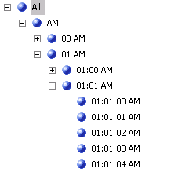

# Creating Time Dimension in Microsoft Analysis Services

Originally posted here:
https://www.codeproject.com/Articles/25852/Creating-Time-Dimension-in-Microsoft-Analysis-Serv

Unlike Date Dimension (with Year, Month, Date), Time Dimension (with Hour, Minutes, and Seconds) is not automatically created by SSAS (Microsoft SQL Server Analysis Services). 
This article explains how to create and use Time Dimension in Microsoft SQL Server Analysis Services.

## Introduction
Sometimes, you need to create a report on a time level (Hour, Minutes, and Seconds). For a relational report, you can use the DATEPART() function to extract time information out of a DateTime column. However, doing this is difficult for an OLAP report. This article explains how to create a Time Dimension table and use it inside SSAS.

## Background
To understand this article, you need to understand the basics of dimensional modeling and Microsoft SQL Server Analysis Services.

## Using the code
The code (zip file) is composed of four scripts:

1. DimTime.sql – CREATE TABLE statement creates the DimTime table.
2. Populate DimTime.sql – Script populates the DimTime table with time info. Each record represents a second.
3. Dim Time.dim – Optional SSAS 2005 dim file you can add to your SSAS database.
4. Populate Fact.sql – Optional sample script shows how to link your fact table to the DimTime dimension.
